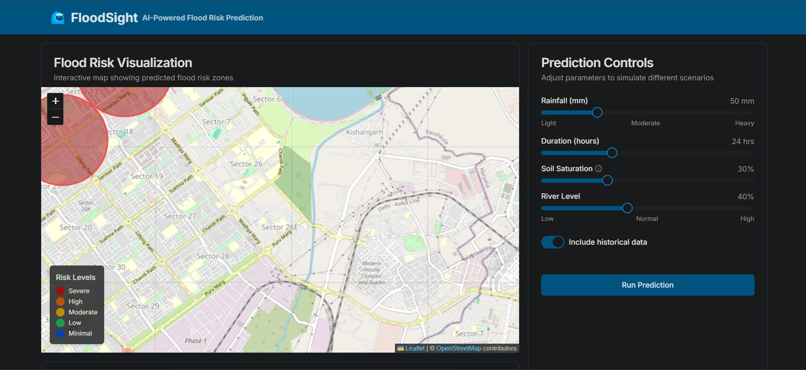

# 🌊 FloodSight - AI-Powered Flood Risk Prediction

<div align="center">



[](https://nextjs.org/)
[](https://www.typescriptlang.org/)
[](https://tailwindcss.com/)

</div>

## 📝 Overview

FloodSight is a cutting-edge web application that leverages artificial intelligence to predict and visualize flood risks. This modern, user-friendly platform provides interactive flood risk mapping, historical data analysis, and predictive modeling capabilities. Built with the latest web technologies, it offers a seamless experience for both users and developers.

## 🎯 Key Features

### 🌍 Interactive Flood Risk Map
- Real-time flood risk visualization
- Interactive zoom and pan controls
- Customizable layer overlays
- Risk level indicators and color coding

### 🤖 AI-Powered Predictions
- Machine learning-based risk assessment
- Historical data analysis
- Weather pattern integration
- Predictive modeling algorithms

### 📊 Data Insights Dashboard
- **Historical Analysis** 📈
  - Past flood events tracking
  - Seasonal patterns visualization
  - Impact assessment metrics
- **Predictive Analytics** 🔮
  - Future risk projections
  - Trend analysis
  - Pattern recognition
- **Comparative Tools** ⚖️
  - Before/After scenarios
  - Risk level comparisons
  - Geographic comparisons

### ⚙️ Customizable Parameters
- Rainfall intensity settings
- Terrain elevation data
- River flow rates
- Climate change scenarios

### 📱 Responsive Design
- Mobile-first approach
- Cross-browser compatibility
- Adaptive layouts
- Touch-friendly controls

## 🛠️ Tech Stack

### 🎨 Frontend
- **Framework**: Next.js 15.1.0
- **Language**: TypeScript
- **Styling**: 
  - Tailwind CSS
  - CSS Modules
  - Custom animations

### 🧩 UI Components
- **Component Library**: 
  - Radix UI (Accessible components)
  - Shadcn/ui (Custom components)
- **Icons**: Lucide React
- **Charts**: Recharts
- **Forms**: React Hook Form + Zod

### 🔧 Development Tools
- **Package Manager**: pnpm
- **Code Quality**:
  - ESLint
  - Prettier
  - TypeScript
- **Version Control**: Git

## 🚀 Getting Started

### 📋 Prerequisites

- Node.js (v18 or higher)
- pnpm (recommended) or npm
- Git

### 🛠️ Installation

1. Clone the repository:
```bash
git clone https://github.com/yourusername/floodsight.git
cd floodsight
```

2. Install dependencies:
```bash
pnpm install
```

3. Set up environment variables:
```bash
cp .env.example .env.local
# Edit .env.local with your configuration
```

4. Start the development server:
```bash
pnpm dev
```

5. Open [http://localhost:3000](http://localhost:3000) in your browser.

### 🏗️ Building for Production

```bash
pnpm build
pnpm start
```

## 📦 Project Structure

```
floodsight/
├── app/                    # Next.js app directory
│   ├── layout.tsx         # Root layout
│   ├── page.tsx           # Home page
│   └── globals.css        # Global styles
├── components/            # React components
│   ├── ui/               # UI components
│   ├── flood-map/        # Map components
│   └── data-insights/    # Data visualization
├── hooks/                # Custom React hooks
├── lib/                  # Utility functions
├── public/              # Static assets
├── screenshots/         # Application screenshots
└── styles/             # Tailwind configurations
```

## �� Configuration

### 📄 Configuration Files

- `next.config.mjs`: Next.js configuration
  - Image optimization
  - API routes
  - Environment variables
- `tailwind.config.ts`: Tailwind CSS configuration
  - Custom theme
  - Plugin settings
  - Responsive breakpoints
- `tsconfig.json`: TypeScript configuration
  - Compiler options
  - Path aliases
  - Type checking rules
- `postcss.config.mjs`: PostCSS configuration
  - Autoprefixer
  - Tailwind processing

## 🤝 Contributing

We welcome contributions! Here's how you can help:

1. Fork the repository
2. Create your feature branch (`git checkout -b feature/AmazingFeature`)
3. Commit your changes (`git commit -m 'Add some AmazingFeature'`)
4. Push to the branch (`git push origin feature/AmazingFeature`)
5. Open a Pull Request

### 📝 Code Style

- Follow the existing code style
- Use TypeScript for all new code
- Add tests for new features
- Update documentation as needed

## 📄 License

This project is licensed under the MIT License - see the [LICENSE](LICENSE) file for details.

## 🙏 Acknowledgments

- 🌟 Thanks to all contributors who have helped shape FloodSight
- 🛠️ Special thanks to the open-source community
- 📚 Documentation contributors
- 🧪 Testing and feedback providers

## 📞 Support

- 📧 Email: support@floodsight.com
- 💬 Discord: [Join our community](https://discord.gg/floodsight)
- 📱 Twitter: [@FloodSight](https://twitter.com/floodsight)

---

<div align="center">

Made with ❤️ by the FloodSight Team

[⬆ Back to Top](#-floodsight---ai-powered-flood-risk-prediction)

</div> 
